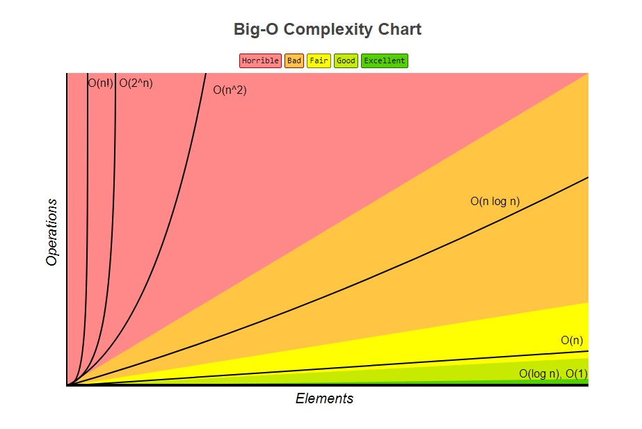
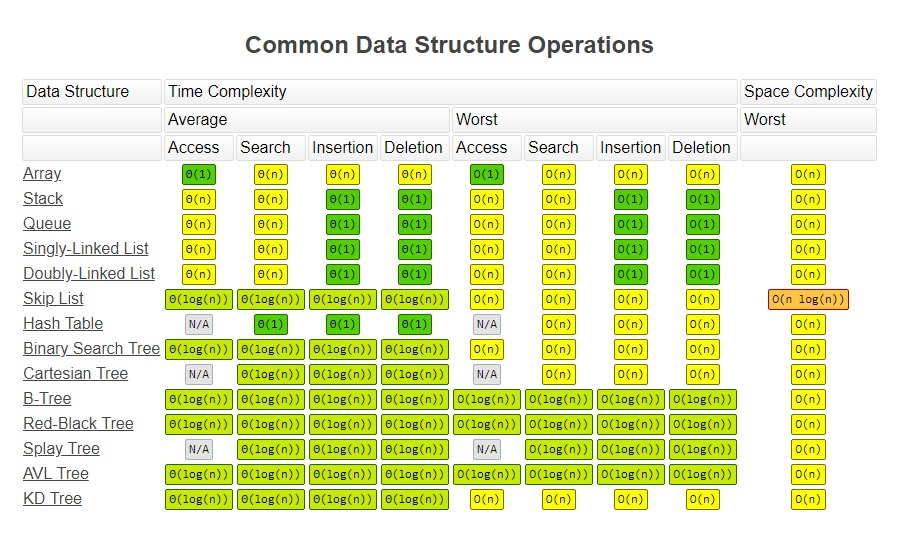

# Big O Notation
- determines which one is best from multiple implemenations of the same function
- describes how runtime depends on inputs

## Who Cares?
* When our code slows down or crashes, identifying parts of the code that are inefficient can help us find pain points in our applications

## What does better mean?
* Faster
* Less memory-intensive
* More readable

## What is good code?
1. Readable
2. Scalable [Big-O] (i. Speed[Time Complexity] & ii. Memory[Space Complexity])

## Time Complexity:
```
- analyze the runtime as the size of the inputs increases
```

## Time Complexity Shorthands:
1. Arithmetic operations are constant.
2. Variable assignment is constant.
3. Accessing elements in an array (by index) or object (by key) is constant.
4. In a loop, the complexity is the length of the loop times.

## Time Complexity Calculation Rules
Rule 1: Worst Case
Rule 2: Remove Constants
Rule 3: Different terms for inputs
```js
function demo(arr1, arr2) { // two inputs
  for(let i = 0; i < arr1.length; i++) {
    console.log(arr1[i]);
  }

  for(let i = 0; i < arr2.length; i++) {
    console.log(arr2[i]);
  }

  // Time Complexity: O(a + b)
}
```
Rule 4: Drop Non Dominants

## (Auxiliary) Space Complexity:
```
- how much additional memory do we need to allocate
```

## Space Complexity Shorthands:
1. Most primitives (booleans, numbers, undefined, null) are constant space.
2. Strings require O(n) space (where n is the string length)
3. Reference types are generally O(n), where n is the length (for arrays) or the number of keys (for objects)

## Remember things of a Program Execution
1. Heap - Store variables
2. Stack - Keep track of function calls

## What causes Space complexity?
* Variables
* Data Structures
* Function Call
* Allocations

## Big O Complexity Chart



## Big Os
```
✅ O(1) Constant Time - no loops
✅ O(logN) Logarithmic - usually searching algorithms have log(n) if they are sorted (Binary Search)
✅ O(n) Linear Time - for, while loops
✅ O(n * log(n)) Log Linear - usually Sorting algorithms
✅ O(n^2) Quadratic Time - every element in a collection needs to be compared to every other element. Two nested loops
✅ O(2^n) Exponential Time - recursive algorithms that solve a problem of size N
✅ O(n!) Factorial Time - Run a loop for every element
✅ Two separate inputs: O(a + b) or O(a * b)
```

## Common Data Structure Operations



## Array Sorting Algorithms

