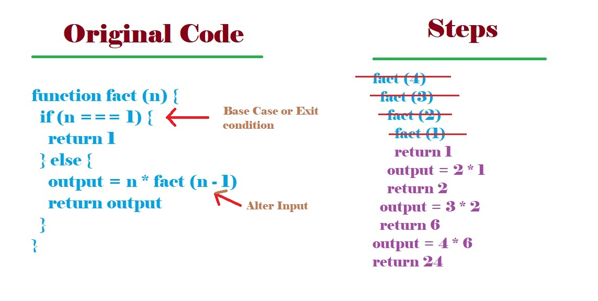

# Recursion

## What is recursion?
A **process** (a function in our case) that **calls itself**

## It's EVERYWHERE!
* JSON.parse / JSON.stringify
* document.getElementById and DOM traversal algorithms
* Object traversal
* It's sometimes a cleaner alternative to iteration

## Two essential parts of recursive function!
* Base Case or Exit Condition
* Different Input or Alter Input

 

## When things go wrong?
* No Base Case
* Forgetting to return or returning the wrong thing!

## Helper Method Recursion

```js
function outer (input) {
  var outerScopedVariable = []

  function helper (helperInput) {
    // modify the outerScopedVariable
    helper (helperInput--)
  }

  helper (input)
  return outerScopedVariable
}
```

**Example-1:** Collect all of the odd values in an array.

## Pure Recursion
* For arrays, use methods like **slice, the spread operator, and concat** that make copies of arrays so you don't mutate them.
* Remember that strings are immutable so you will need to use methods like **slice, substr, or substring** to make copies of strings.
* To make copies of objects use **Object.assign, or the spread operator**.